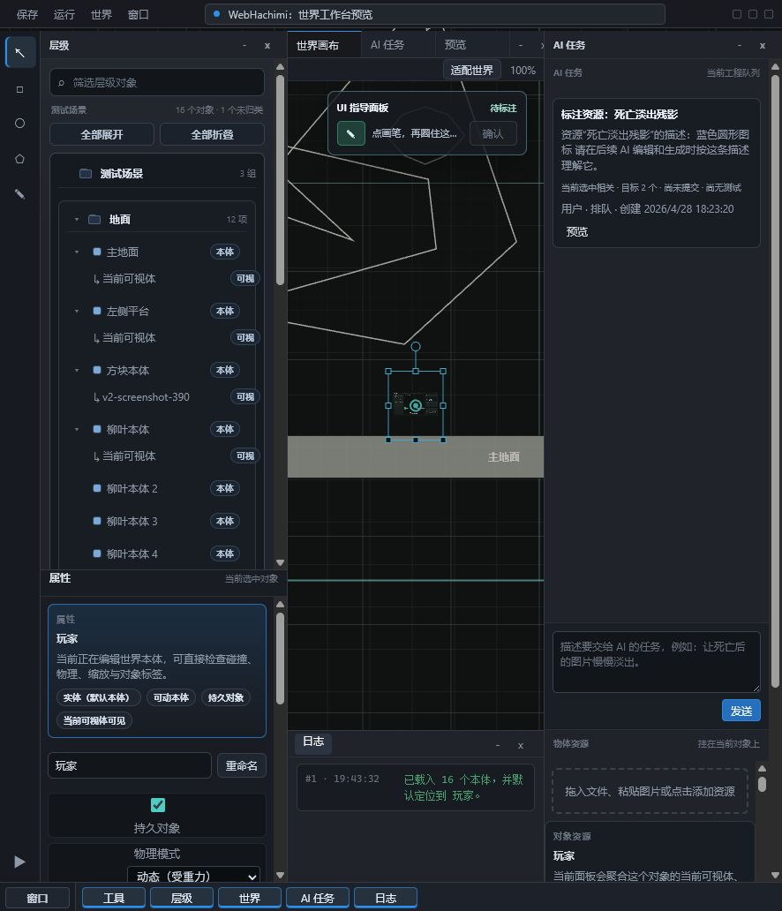

# WebHachimi Engine

[](https://github.com/Tanmologist/WebHachimi/actions/workflows/ci.yml)
[](LICENSE)
[](https://www.typescriptlang.org/)

WebHachimi is an open-source TypeScript/Pixi browser game editor, 2D runtime,
static export pipeline, and verification workbench. It is built around a
transactional project model, fixed-step runtime simulation, scripted smoke
tests, autonomous verification records, and a concrete game package
(`Hachimi Nanbei Lvdong`) that exercises the editor/runtime boundary.

The project is early-stage, but actively maintained. Recent work focuses on
module boundaries, runtime/editor handoff, static game export, automated smoke
coverage, and making the codebase easier for maintainers and coding agents to
review safely.



## Project Snapshot

- Public OSS repository maintained by `Tanmologist`.
- Browser-first 2D game editor and player runtime with Pixi rendering.
- Concrete playable/exportable game package under `games/hachimi-nanbei-lvdong/`.
- Static game export path for hosting without the local project API.
- Transactional project store with undo/redo, dry-run patches, rollback records,
  task evidence, runtime snapshots, and autonomous verification reports.
- Full smoke suite covering editor persistence, resource animation/import,
  collision geometry, runtime visibility, performance budgets, combat action
  protocol, gameplay workshops, timing sweeps, and autonomy records.
- MIT licensed.

This workspace is the new main project. Legacy files are kept here only as
comparison material while the editor is rebuilt and expanded.

## Documentation

- [Architecture](ARCHITECTURE.md): module boundaries and data flow.
- [Roadmap](ROADMAP.md): current priorities and planned milestones.
- [Maintainer guide](docs/maintainer-guide.md): release, verification, and triage workflow.
- [Editor guide](docs/editor-guide.md): practical overview of the current editor surface.
- [Verification guide](docs/verification.md): smoke, timing, autonomy, and export checks.
- [Cleanup plan](CLEANUP_PLAN.md): what legacy material is retained and why.

## Recommended Run

Use Vite for the generic WebHachimi editor:

```powershell
npm ci
npm run dev:editor
```

Then open:

```text
http://127.0.0.1:5173/apps/webhachimi/editor.html
```

Use the Hachimi Nanbei Lvdong game entry for the concrete game package:

```powershell
npm run dev:game
```

The game package also has its own editor entry, because the game is the editor/runtime shell plus a concrete project:

```powershell
npm run dev:game:editor
```

## Legacy Run

The legacy editor is still available for comparison:

```powershell
npm run serve:legacy
```

Then open:

```text
http://localhost:5577/index.html
```

Legacy direct file mode can still open `index.html`, with browser-local persistence.

## Project Boundary

- The generic editor shell lives at `apps/webhachimi/editor.html` and declares `/api/webhachimi/project` through page metadata.
- Concrete game entries declare their own project endpoint through page metadata; the Hachimi Nanbei Lvdong package lives under `games/hachimi-nanbei-lvdong/` and uses `/api/games/hachimi-nanbei-lvdong/project`.
- The legacy `/api/v2/project` route remains as a compatibility alias for the Hachimi game project.
- The Hachimi seed project lives in `games/hachimi-nanbei-lvdong/project.json`; runtime saves go to ignored `games/hachimi-nanbei-lvdong/local/project.json`.
- Hachimi game resources live in `games/hachimi-nanbei-lvdong/resources/`.
- Legacy editor uses `/api/project`.
- Legacy seed data lives in `data/project.json`; runtime saves go to ignored `data/local/project.json`.

Keep these paths separate. Do not mix legacy project payloads with v2 project payloads.

## Build

```powershell
npm run typecheck
npm run build
npm run build:editor
npm run build:game
npm run export:game
npm run verify
```

The production output is written to:

```text
dist-v2/
```

`dist-v2/` is a build artifact and is not source.

## Static Game Export

To export the concrete game as a standalone static web package:

```powershell
npm run export:game
```

The exporter builds the game, writes `exports/hachimi-nanbei-lvdong/index.html`,
copies bundled JS/CSS to `assets/`, copies referenced project resources to
`resources/`, and embeds the project JSON directly into the page. The exported
folder can be served by any static web server and does not require the local
project API.

To verify the export path with a fresh game build:

```powershell
npm run smoke:export-game
```

This smoke check inspects the generated package and boots it in Chromium from a
temporary static server to catch missing files, local API requests, and player
startup errors.

For a production preview after building, run:

```powershell
npm run serve
```

The server opens the rebuilt editor at:

```text
http://localhost:5577/apps/webhachimi/editor.html
```

If `dist-v2/` is missing, `server.js` returns an explicit build-required error for rebuilt editor/game entries instead of silently serving source HTML that cannot load through the production static allowlist.

## Verification

Run the full smoke suite through the unified verification entry:

```powershell
npm run verify
```

To run only smoke checks:

```powershell
npm run smoke
```

The smoke suite currently includes these fast checks. The export smoke is
available separately because it performs its own game build.

```powershell
npm run smoke:persistence
npm run smoke:persistence-api
npm run smoke:samples
npm run smoke:folder-move
npm run smoke:task-workflow
npm run smoke:super-brush-evidence
npm run smoke:task-panel
npm run smoke:autonomy-summary
npm run smoke:viewport
npm run smoke:keyboard
npm run smoke:context-menu
npm run smoke:entity-properties
npm run smoke:resource-import
npm run smoke:resource-animation
npm run smoke:world-manager
npm run smoke:world-speed
npm run smoke:canvas-transform
npm run smoke:collision-geometry
npm run smoke:presentation-label
npm run smoke:floating-panels
npm run smoke:workspace-presets
npm run smoke:runtime-visibility
npm run smoke:performance
npm run smoke:combat-action-protocol
npm run smoke:workshops
npm run smoke:transform
npm run smoke:sweep
npm run smoke:autonomy
```

These cover the current rebuild spine: editor persistence and persistence API assembly, sample project boundaries, user transaction slices, canvas viewport and transform math, context menu/resource workflows, collision geometry, presentation labels, floating panel docking constraints, runtime-only template visibility, a conservative runtime performance budget, gameplay workshops, timing sweep expectations, and autonomous task/test records.

## Toolchain

Use Node.js `24.12.0` and npm `11.x`. The pinned local version lives in `.nvmrc`, and `package.json` declares matching engines. CI installs with `npm ci` and runs `npm run verify`.

## Build Boundary

Development and editor tooling may use Node.js, TypeScript, downloaded assets, and build tools. Exported player builds must be click-to-play and must not require players to install Node.js, TypeScript, package managers, editor dependencies, or local services.

## Important Files

- `apps/webhachimi/editor.html`, `src/editor/*`: generic editor shell. It should not hard-code concrete game packages.
- `games/hachimi-nanbei-lvdong/index.html`, `src/player/*`: concrete game player entry.
- `games/hachimi-nanbei-lvdong/editor.html`: concrete game editor entry.
- `src/samples/*`: bundled fallback/sample project data used by editor/player when no saved project exists.
- `src/project/*`: project schema, transactions, diffs, persistence, tasks, and maintenance.
- `src/runtime/*`: runtime world, collision, and timing.
- `src/ai/*`: rule-based task planning and execution loop.
- `src/verification/*`: autonomous verification, timing sweep, telemetry, and scripted runtime checks.
- `src/testing/*`: smoke-test entry points and compatibility exports for verification helpers.
- `index.html`, `styles.css`, `app.js`: legacy single-page editor/runtime kept as rebuild reference.
- `server.js`: local static server plus legacy and v2 project persistence API.
- `data/project.json`: legacy starter project data.
- `games/hachimi-nanbei-lvdong/project.json`: Hachimi Nanbei Lvdong starter project data.
- `WEBHACHIMI_REBUILD_PLAN.md`: rebuild plan for this workspace.

## Rebuild Rule

Use the source project for behavior, product ideas, and implementation evidence. Do not preserve old structure by default. Do not copy `.git/`, `node_modules/`, or `dist-v2/`; install dependencies with `npm ci` and rebuild outputs locally.
